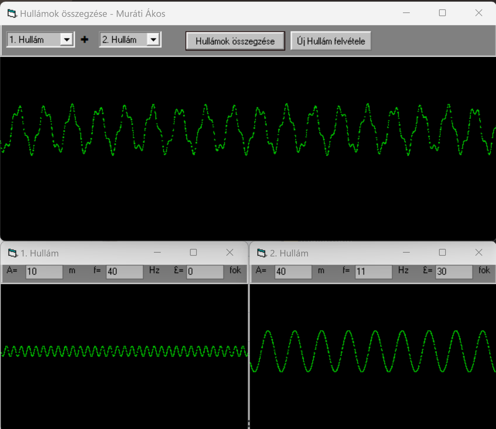
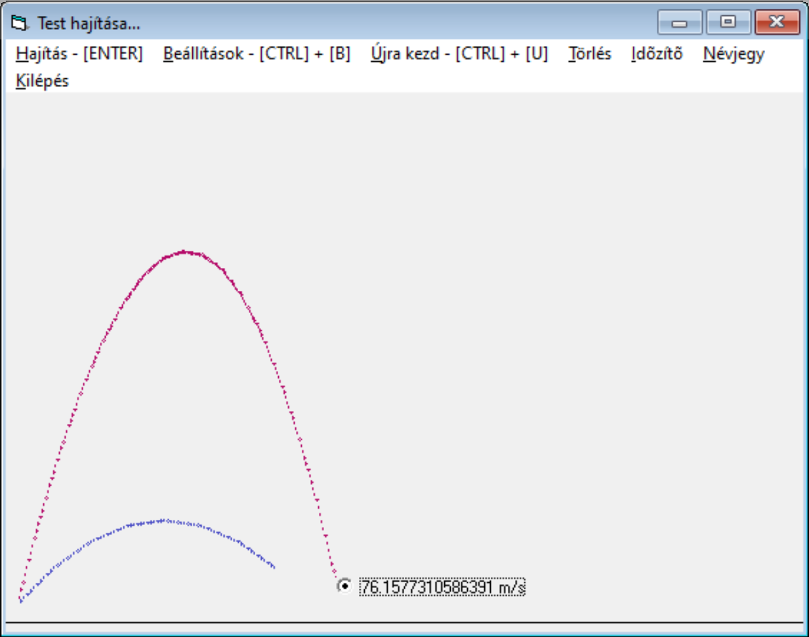

# Primary School Science Demos - Project Archive
> This is an archive project collecation, unmaintained since 2003.

This repository is a science and math demonstration and educational
software archive written in the early 2000s as a student.

The demonstration demo applications were written in Visual Basic 6.
For binary compilations, dependency and setup files, check releases.

## Physics
### Hullámok
Sine Wave composer, operations and visualisation application

### Hajitas
Basic throwing and gravitational force visual demonstration app

### Mezők
Charged particles demonstration app

## Development Requirements
 - Visual Studio 6
    - Visual Basic 6.0 language support
 - Nullsoft Install System
