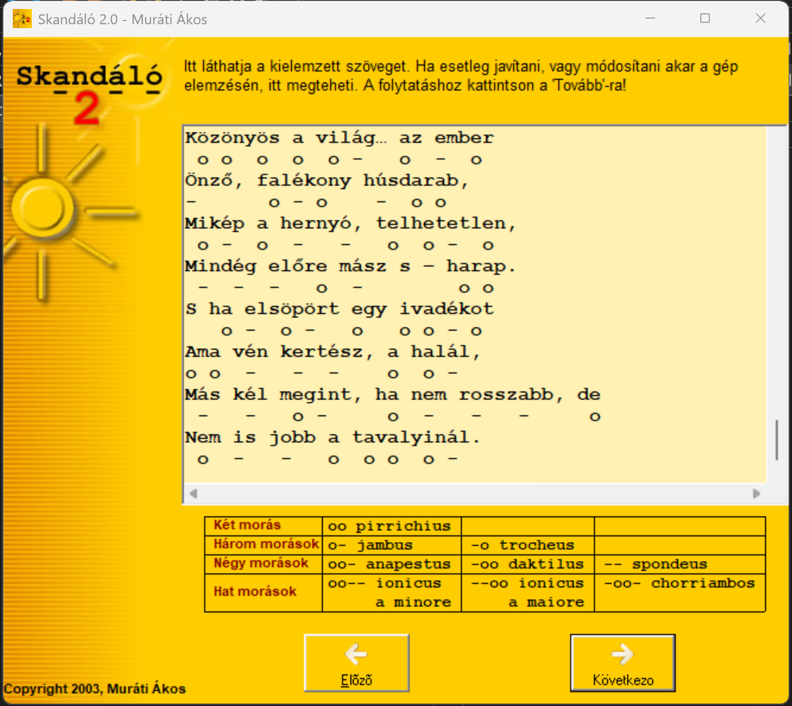
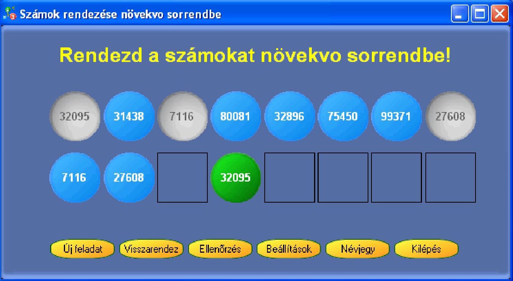
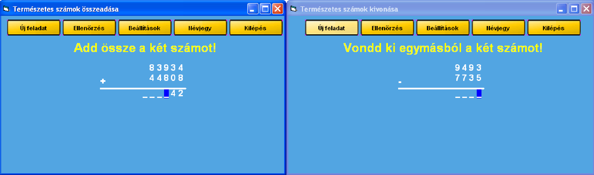
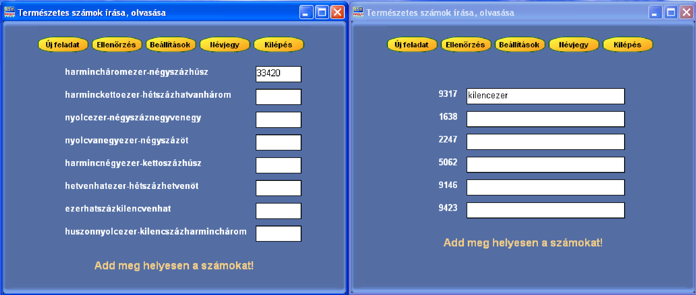
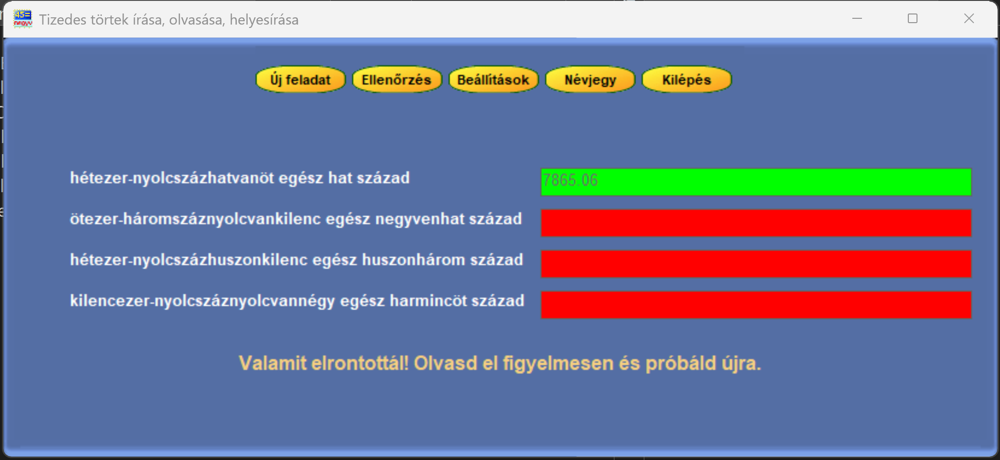
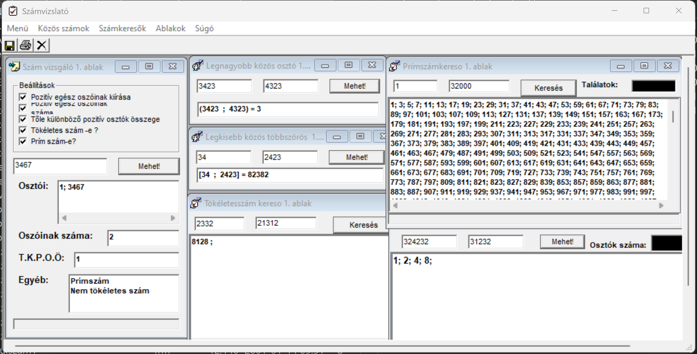

# Primary School Education tools - Project Archive
> This is an archive project collecation, unmaintained since 2003.

This repository is a science, math and literature demo and educational
software archive written in the early 2000s by me as a student.

The demonstration demo applications were maily written in Visual Basic 6
or Pascal for DOS and Windows.

For binary compilations, dependency and setup files, check releases.

## Physics
### Hullámok
Sine Wave composer, operations and visualisation application

### Hajitas
Basic throwing and gravitational force visual demonstration app

### Mezők
Charged particles field inertia demonstration app

## Literature
### Skandáló
Rythmic analyzer application to map long and short vowel
sequences to antique formulas to understand better vers
and lyrics rhythms.

## Mathematics
Mainly 4th and 5th grade primary school mathematic practicing
and demonstration apps.
 
### Ordering natural numbers
Drag and drop ordering application to practice value comprehension
of natural numbers.

### Addition and Subtraction
The application teaches and allows practicing of additions and
substractions of natural numbers.

### Spelling natural numbers
The application teaches the reading and correct Hungarian
spelling of natural numbers.

### Spelling decimal fractions
The application teaches the reading and correct Hungarian spelling of
decimal fractions.

### Number analyzer
A simple desktop application to examine and find special numbers from
various mathematical contexts - like primes, highest common factor (hcf),
greatest common divisor (GCD), euclide-numbers, perfect numbers, etc..

## Development Requirements
 - Visual Studio 6
    - Visual Basic 6.0 language support
 - Nullsoft Install System
